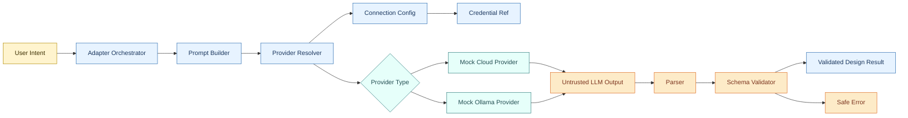

# Meshery AI Adapter Design Spike

A small TDD-driven Go design spike for the Meshery LFX 2026 AI Adapter / AI Connections problem space. It models the adapter boundary, BYOM provider abstraction, credential-safe configuration, and schema-validated LLM output without using real providers.

This is not an official Meshery implementation. It intentionally skips gRPC, real provider calls, UI, Kubernetes, and full protobuf. The goal is to demonstrate architecture understanding before proposing an implementation.

## Why this exists

- The hard part is not the API call. It is the boundary between adapter, connections, credentials, providers, and validation.
- This repo shows a minimal, test-first pipeline that keeps credentials out of prompts and validates all model output.

## Scope

### In scope

- Adapter orchestration for a single intent
- BYOM provider abstraction with mock cloud and mock local providers
- Credential references only (no secrets in logs or prompts)
- Parsing and validation of untrusted output

### Out of scope

- Real Meshery adapter or server APIs
- Real OpenAI or Ollama integrations
- gRPC/protobuf, UI, or Kubernetes deployment

## Architecture at a glance



## Minimal design model

```json
{
    "name": "nginx-prometheus-stack",
    "components": [
        {"id": "comp-1", "name": "nginx", "type": "Deployment"},
        {"id": "comp-2", "name": "prometheus", "type": "Service"}
    ],
    "relationships": [
        {"source": "comp-1", "target": "comp-2", "kind": "observes"}
    ]
}
```

## Project layout

```
meshery-ai-adapter-design-spike/
├── cmd/demo/           demo wiring two scenarios end to end
├── internal/
│   ├── adapter/        orchestrator - owns the pipeline
│   ├── connection/     Connection and CredentialRef types
│   ├── design/         Design types, JSON parser, field validator
│   ├── errors/         domain error types
│   ├── prompt/         prompt builder
│   └── provider/       LLMProvider interface + mock providers
├── testdata/           JSON fixtures for parser tests
├── docs/               architecture and TDD plan
└── .github/workflows/  go test -race ./... on every push
```

## Running

```bash
go test -v ./...
go run ./cmd/demo/
```

No external dependencies. Standard library only.

## Testing strategy

- Unit tests cover resolver selection, credential boundaries, prompt shaping, parsing, validation, and adapter orchestration.
- Provider mocks honor context cancellation so timeout paths are testable.
- CI runs `go test -v -race ./...` on every push and PR.

## Docs

- docs/architecture.md
- docs/tdd-plan.md
