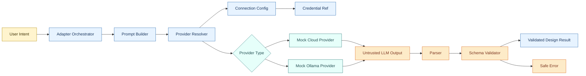
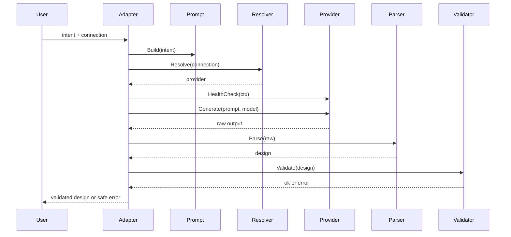

# Architecture

## System flow



## Component responsibilities

### Adapter (internal/adapter)

Orchestrates the pipeline. Knows nothing about:
- Provider HTTP details
- Credential secret values
- JSON parsing internals
- Validation rules

If you add logging, tracing, or retry logic, this is the only place it goes.

### Provider (internal/provider)

Defines the `LLMProvider` interface and the two mocks. The interface is three methods:

```go
Name()        string
Generate()    (*ProviderResponse, error)
HealthCheck() error
```

`ProviderResponse.Raw` is named to remind callers it is untrusted and must be parsed before use. The mocks honor context cancellation so timeout paths are testable.

### Connection and Credential (internal/connection)

`Connection` holds everything needed to route a request: provider type, base URL, model, and a `CredentialID` reference. It never holds a secret value.

`CredentialRef` is a pointer (ID + type). `CredentialStore.Lookup` confirms existence without surfacing the actual key. In a real Meshery implementation this would call the credentials API.

### Prompt (internal/prompt)

`Builder.Build(intent)` assembles the final prompt string from:
1. User intent (free text)
2. Schema rules (typed struct, not free text)

The builder has no knowledge of credentials, provider types, or network addresses. It cannot accidentally leak secrets because they are never passed to it.

### Design (internal/design)

Two steps, always in order:

1. `ParseDesignResponse(raw)` - JSON unmarshal with markdown fence stripping. Returns `*ParseError` on failure.
2. `ValidateDesign(d)` - field-level checks plus referential integrity on relationships. Returns `*ValidationError` on failure.

A `Design` that passes both is considered safe to return to the caller.

### Errors (internal/errors)

Four typed errors:

| Type | When |
|---|---|
| `ProviderError` | provider health check or generate call fails |
| `ValidationError` | a required field is missing or a relationship reference is invalid |
| `ParseError` | LLM output is not valid JSON |
| `CredentialError` | credential ID not found in the store |

All errors wrap their cause so callers can use `errors.As` to distinguish them.

## Provider resolver logic

```
LocalOnly == true  ->  always Ollama
ProviderType == "ollama"  ->  Ollama
ProviderType == "cloud"   ->  Cloud
anything else             ->  error
```

`LocalOnly` takes precedence over `ProviderType` so that user privacy preferences cannot be overridden by an incorrect config field.

## Sequence (single request)


